# Procesverslag
**Auteur:** -Ian Hoogenboom-

Markdown cheat cheet: [Hulp bij het schrijven van Markdown](https://github.com/adam-p/markdown-here/wiki/Markdown-Cheatsheet). Nb. de standaardstructuur en de spartaanse opmaak zijn helemaal prima. Het gaat om de inhoud van je procesverslag. Besteedt de tijd voor pracht en praal aan je website.

## Bronnenlijst
1. Afbeelding header: https://www.volkswagen.nl/-/media/vwpkw/images/homepage/homepage-hero-polo-pl-sm-v3.ashx

2. Afbeelding corona: https://www.volkswagen.nl/-/media/vwpkw/images/homepage/corona-16-logo.ashx?w=507&q=70&hash=E52C1D11A9DAF92345C9B9D10A180AAC

3. Afbeeldingen grid: https://presspage-production-content.s3.amazonaws.com/uploads/1397/500_volkswagenarteonshootingbrake-2.jpg?10000
https://www.volkswagen.nl/-/media/vwpkw/images/homepage/tile-module/id3tje/tile-id3tje-1x1.ashx?w=1013&q=70&hash=3FF0F30F9EEE465C763F455125A2BFB3
https://www.volkswagen.nl/-/media/vwpkw/images/modellen/id4/id4-homepage-tile-onthulling.ashx?w=1223&q=70&hash=2912D427007B42B3ECC3FFE111C8B55A
https://www.volkswagen.nl/-/media/vwpkw/images/homepage/tile-module/id3-1-1.ashx?w=507&q=70&hash=91C7739410B4AE1F8D1E5C37111785C4
https://www.volkswagen.nl/-/media/vwpkw/images/homepage/tile-module/golf-variant-tile.ashx?w=1013&q=70&hash=E7CC6CF698A382E4AE655ED37C6092EE
https://www.volkswagen.nl/-/media/vwpkw/images/homepage/tile-module/tile-homepagine-bandenwissel-16x9-v3.ashx?w=1013&q=70&hash=E0143C3EA1CA509AFBD84417E0D34C8A

4. fonts: https://www.volkswagen.nl/Fonts/VW-PKW/VWHeadWeb-Bold.woff2
https://www.volkswagen.nl/Fonts/VW-PKW/VWHeadWeb-Light.woff2
https://www.volkswagen.nl/Fonts/VW-PKW/VWHeadWeb-Regular.woff2
https://www.volkswagen.nl/Fonts/VW-PKW/VWTextWeb-Bold.woff2
https://www.volkswagen.nl/Fonts/VW-PKW/VWTextWeb-Regular.woff2

5. iconen; https://www.volkswagen.nl/Images/vw-pkw/logo__image.svg

## Eindgesprek (week 7/8)

-dit ging goed & dit was lastig-

**Screenshot(s):**

-screenshot(s) van je eindresultaat-

## Voortgang 3 (week 6)

-same as voortgang 1-

## Voortgang 2 (week 5)

Ik ben bezig met mijn menu, maar met de rest van de website loop ik een beetje vast met waar ik moet beginnen

**Screenshot(s):**

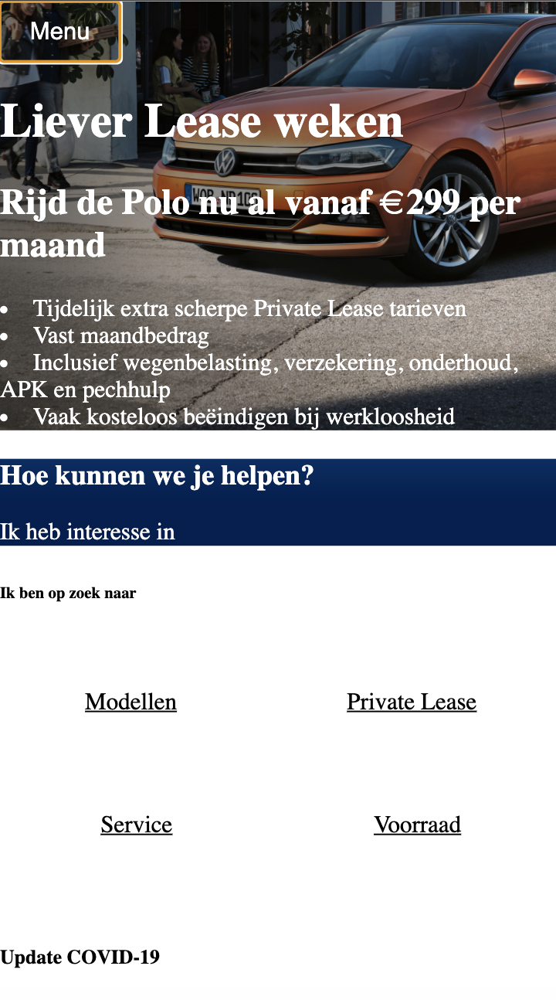

### Agenda voor meeting

Bente: Ik wil graag hulp met js voor de 'slider'
Ik wil graag hulp bij de vekleuring van de achtergrond bij verschillende telefoonformaten- |
Joep: Ik wil weten of je meerdere ul in je navigatie mag gebruiken |
Merel: Ik wil graag weten in hoe ver mijn formulier moet werken |
Ian: Ik wil graag wat hulp met m'n javascript

### Verslag van meeting

Wij gaan verder met onze website en gaan onze vragen stellen in de meeting.

## Voortgang 1 (week 3)

### Stand van zaken

Ik ben nog niet begonnen met de website,
maar de huiswerk opdrachten tot nu toe lukken aardig.

**Screenshot(s):**

Heb ik nog niet.

### Agenda voor meeting

| Bente                 | Joep                   | Merel              | Ian                                 |
| ---                   | ---                    | ---                | ---                                 |
| Hoe plaats je         | Hoe je een website     | Heeft een vraag    | De layout /                         |
| een dropdown icoon    | simpel responsive maakt| over de layout van | positionering van plaatjes          |
| naast de summary      | ...                    | het hamburger menu | Dit weekend ga ik een start maken   |

Bente: Hoe komt een summary open te staan?

### Verslag van meeting

Bovenstaande vragen gaan wij tijdens de meeting vragen en daarnaast gaan wij verder of maken we een start met onze website.

## Breakdownschets (week 1)

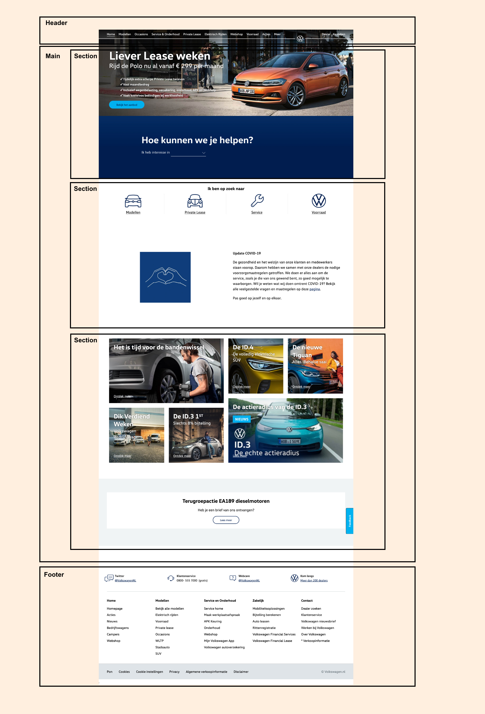

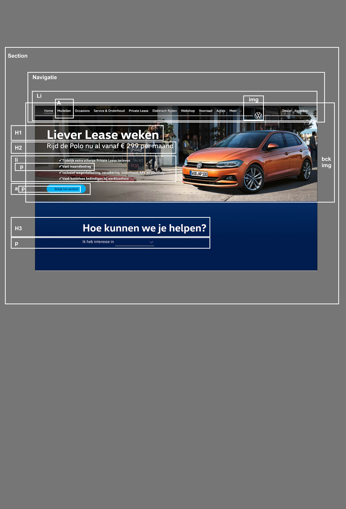

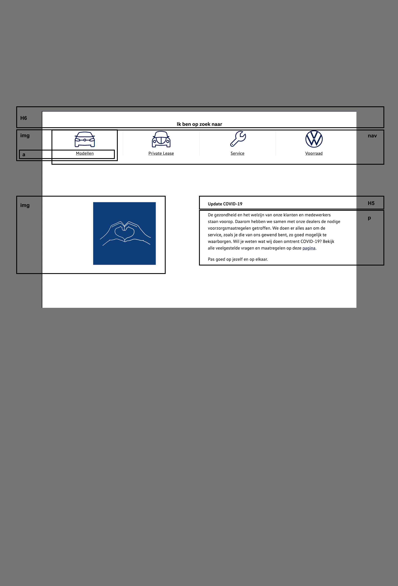

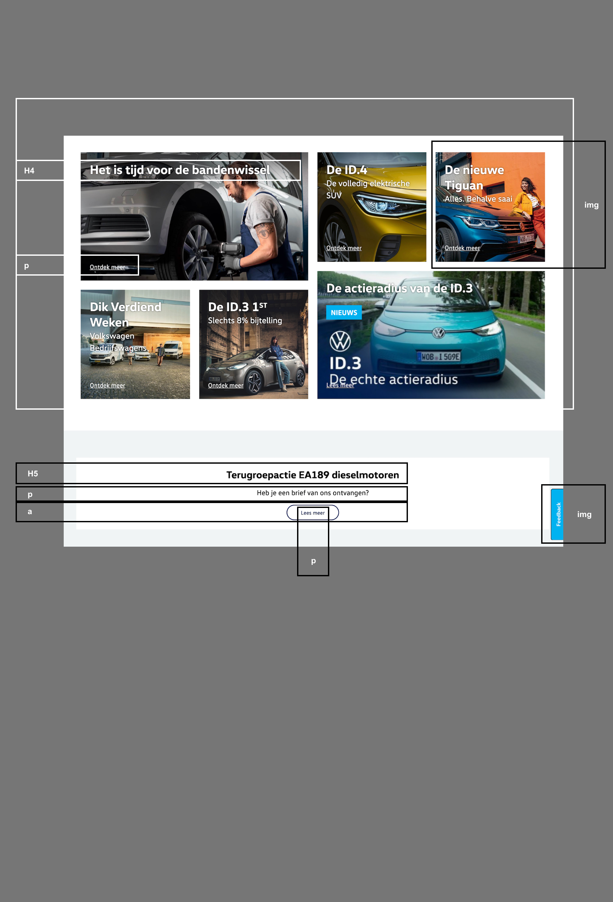

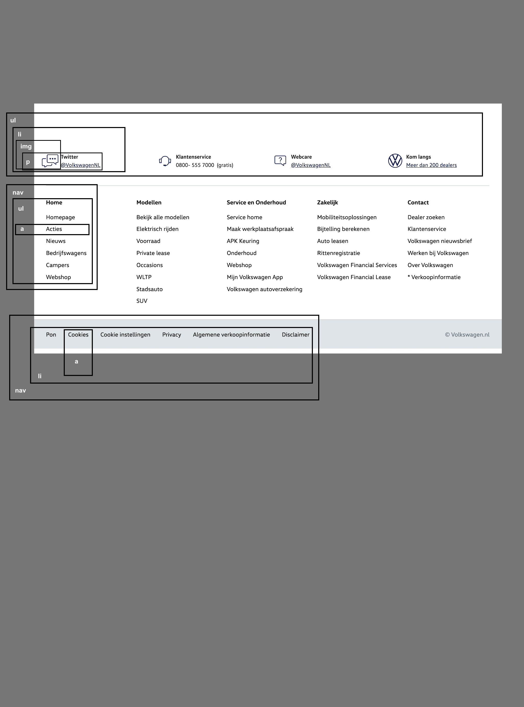

## Intake (week 1)
-uitwerken voor de kick-off werkgroep - begin van de eerste week-

**Je startniveau:** -blauw-

**Je focus:** -responsive -

**Je opdracht:** -https://www.volkswagen.nl-

**Screenshot(s) van de eerste pagina (small screen):**

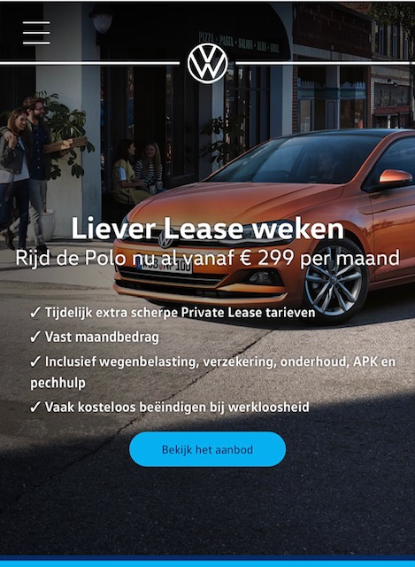

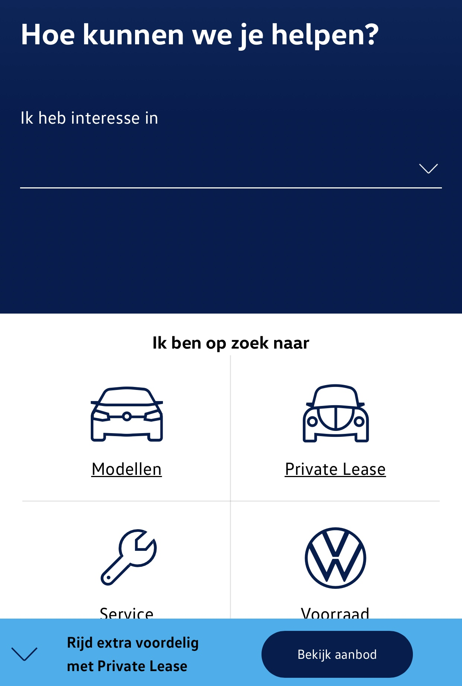

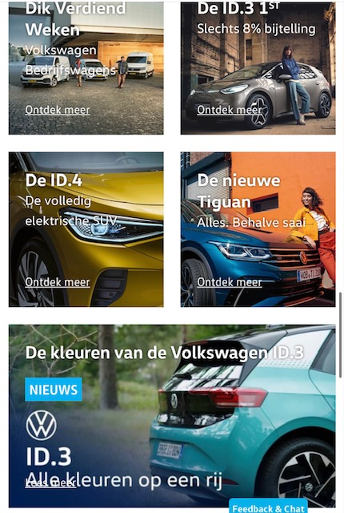

**Screenshot(s) van de tweede pagina (small screen):**

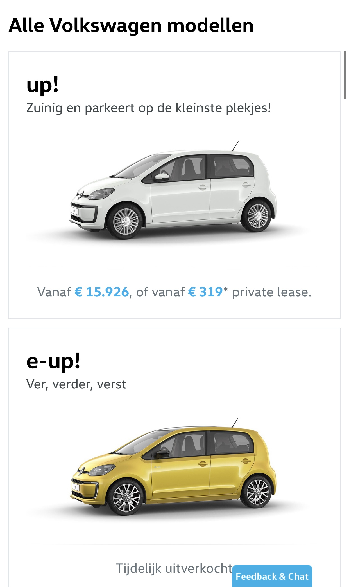

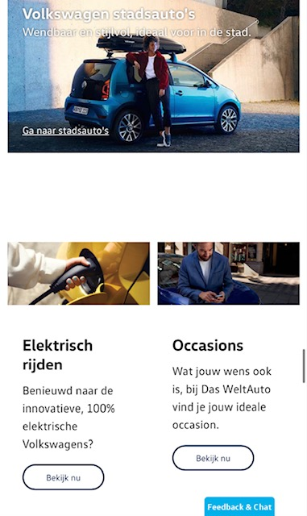
